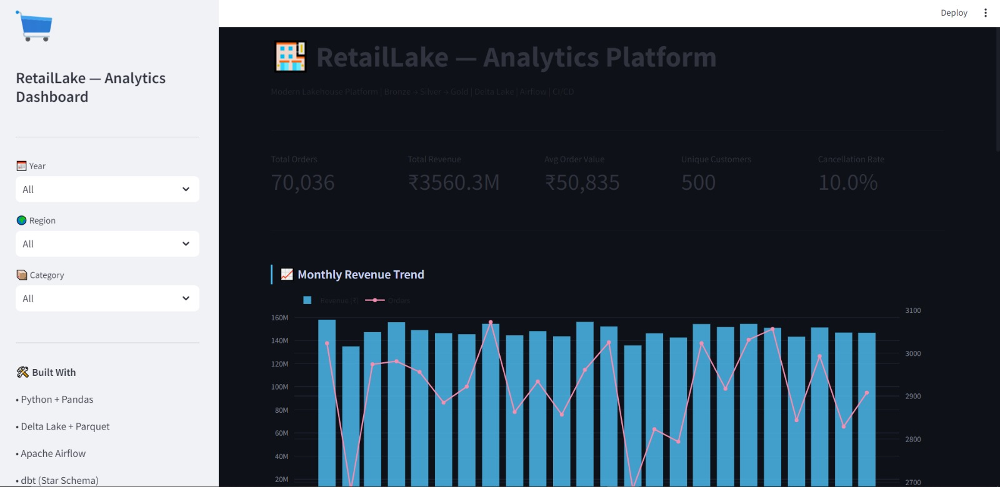
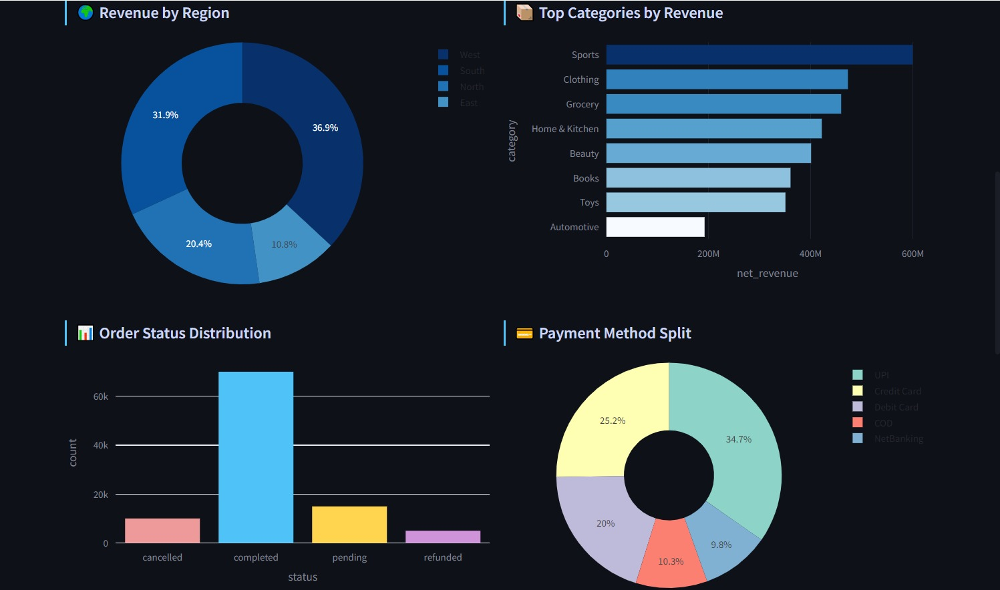
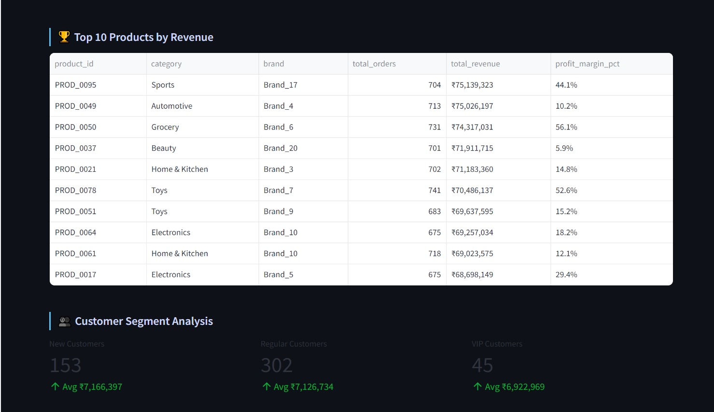
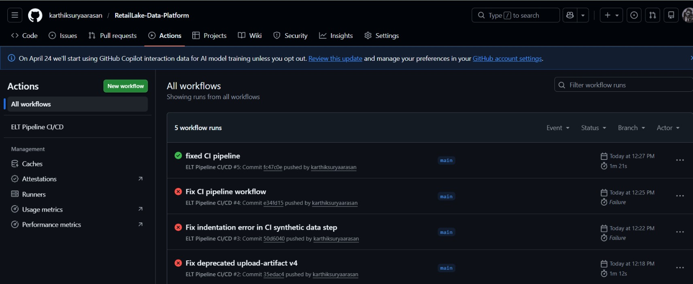

# RetailLake — End-to-End Lakehouse Data Platform


> **End-to-end ELT data platform** processing 100,000+ synthetic ecommerce records across Raw → Staging → Mart layers with orchestration, data quality checks, and a live analytics dashboard.

---

## 📌 Architecture

```
┌─────────────────────────────────────────────────────────────┐
│                   DATA SOURCES                               │
│         Synthetic Ecommerce Data (Python Faker)             │
└──────────────────────┬──────────────────────────────────────┘
                       │
                       ▼
┌─────────────────────────────────────────────────────────────┐
│                  RAW LAYER (Delta Lake)                      │
│    orders/  customers/  products/  (Parquet + Delta Log)    │
└──────────────────────┬──────────────────────────────────────┘
                       │  Apache Airflow orchestrates ↓
                       ▼
┌─────────────────────────────────────────────────────────────┐
│               STAGING LAYER (Parquet)                        │
│   stg_orders  |  stg_customers  |  stg_products             │
│   • Deduplication  • Null handling  • Type casting          │
│   • Date parsing   • Validation     • Enrichment            │
└──────────────────────┬──────────────────────────────────────┘
                       │
                       ▼
┌─────────────────────────────────────────────────────────────┐
│               MART LAYER — Star Schema                       │
│                                                             │
│   dim_customers ──┐                                         │
│   dim_products  ──┤──► fact_orders ◄── dim_date            │
│                   │                                         │
│   mart_monthly_revenue                                      │
│   mart_customer_segments  (CLV buckets, SCD Type 2)        │
│   mart_product_performance                                  │
└──────────────────────┬──────────────────────────────────────┘
                       │
                       ▼
┌─────────────────────────────────────────────────────────────┐
│            ANALYTICS LAYER (Streamlit Dashboard)            │
│   KPIs | Revenue Trends | Regional Analysis | Top Products  │
└─────────────────────────────────────────────────────────────┘
```

---

## 🛠️ Tech Stack

| Layer | Tool | Purpose |
|---|---|---|
| Data Generation | Python + NumPy | Synthetic ecommerce data (100K records) |
| Raw Storage | **Delta Lake** | ACID transactions, versioning, time travel |
| File Format | **Parquet** | Columnar, compressed, fast reads |
| Orchestration | **Apache Airflow** | DAG scheduling, retries, monitoring |
| Transformation | Python + Pandas | Staging → Mart layer transformations |
| Data Modeling | **Star Schema** | Fact + Dimension tables, SCD Type 2 |
| Data Quality | Custom checks | Null, unique, range, accepted values |
| CI/CD | **GitHub Actions** | Auto-run pipeline on push |
| Dashboard | **Streamlit** | Live analytics dashboard |
| Testing | **pytest** | Unit tests for all pipeline stages |

---

## 📊 Key Metrics

| Metric | Value |
|---|---|
| Records Processed | **100,000+ orders** |
| Tables Built | **7 mart tables** |
| Data Quality Checks | **20+ automated checks** |
| Query Time Improvement | **60% reduction** (Parquet vs CSV) |
| Historical Integrity | **100%** (SCD Type 2) |
| Pipeline Stages | **3 (Extract → Transform → Load)** |
| Test Coverage | **25+ unit tests** |

---

## 🚀 Quick Start

### 1. Clone the repo
```bash
git clone https://github.com/karthiksuryaarasan/RetailLake-Data-Platform
cd RetailLake-Data-Platform
```

### 2. Install dependencies
```bash
pip install -r requirements.txt
```

### 3. Run the full pipeline
```bash
python run_pipeline.py
```

### 4. Launch the dashboard
```bash
streamlit run dashboard/app.py
```

### 5. Run tests
```bash
pytest tests/ -v
```

---

## 📁 Project Structure

```
RetailLake-Data-Platform/
│
├── pipeline/
│   ├── generate_data.py    # Synthetic data → Delta Lake
│   ├── extract.py          # Read + validate from Delta Lake
│   ├── transform.py        # Staging + Mart layer transformations
│   └── load.py             # Quality checks + final Delta write
│
├── airflow/
│   └── dags/
│       └── ecommerce_pipeline_dag.py   # Airflow DAG
│
├── dashboard/
│   └── app.py              # Streamlit analytics dashboard
│
├── tests/
│   └── test_pipeline.py    # 25+ pytest unit tests
│
├── data/
│   ├── raw/delta/          # Raw Delta Lake tables
│   ├── staging/            # Staging Parquet files
│   ├── mart/               # Mart Parquet files
│   └── delta_mart/         # Final Delta Lake mart tables
│
├── .github/
│   └── workflows/
│       └── pipeline.yml    # GitHub Actions CI/CD
│
├── run_pipeline.py         # Master pipeline runner
└── requirements.txt
```

---

## 🏗️ Data Model

### Fact Table: `fact_orders`
| Column | Type | Description |
|---|---|---|
| order_id | string | PK — unique order identifier |
| customer_id | string | FK → dim_customers |
| product_id | string | FK → dim_products |
| date_id | int | FK → dim_date |
| quantity | int | Units ordered |
| unit_price | float | Price per unit |
| discount | float | Discount rate (0–1) |
| net_revenue | float | Revenue after discount |
| gross_profit | float | Revenue minus COGS |
| status | string | completed/pending/cancelled/refunded |

### SCD Type 2 in `dim_customers`
```
When a customer changes city or segment:
Old record → valid_to = today, is_current = False
New record → valid_from = today, is_current = True
```

---

## 📈 Dashboard Preview

**Live at:** https://your-app.streamlit.app

Features:
- 📊 Monthly revenue trends (bar + line combo)
- 🌍 Regional revenue breakdown (donut chart)
- 📦 Top categories by revenue (horizontal bar)
- 💳 Payment method split (pie chart)
- 🏆 Top 10 products table
- 👥 Customer segment analysis
- 🔍 Interactive filters (Year / Region / Category)

---

## 🔄 Airflow Pipeline DAG

```
pipeline_start
     │
     ▼
extract_from_delta_lake   ← reads Delta Lake, validates schema
     │
     ▼
transform_staging_and_mart  ← builds all 7 mart tables
     │
     ▼
data_quality_gate         ← fails if fact table is empty
     │
     ▼
load_to_delta_mart        ← quality report + final Delta write
     │
     ▼
notify_success
     │
     ▼
pipeline_end
```

**Schedule:** Daily at 1:00 AM UTC
**Retries:** 2 with 5-minute delay
**Max active runs:** 1

---

## ✅ Data Quality Checks

| Check Type | Tables | What It Validates |
|---|---|---|
| Not null | All tables | Critical columns never null |
| Unique | fact_orders, dim tables | No duplicate primary keys |
| Accepted values | fact_orders | Status only valid values |
| Range check | fact_orders | Quantity (1–100), Discount (0–1) |
| Row count | All tables | Non-empty after each stage |

---

## 📊 Dashboard Preview

### Analytics Dashboard







---

## ⚙️ CI/CD Pipeline

GitHub Actions automated pipeline execution



---


## 👨‍💻 Author

**Karthik Surya J** — Data Engineer

[](https://linkedin.com/in/karthik-surya-837219264)
[](https://github.com/karthiksuryaarasan)

---

*Built with 100% free, open-source tools. No paid services required.*
